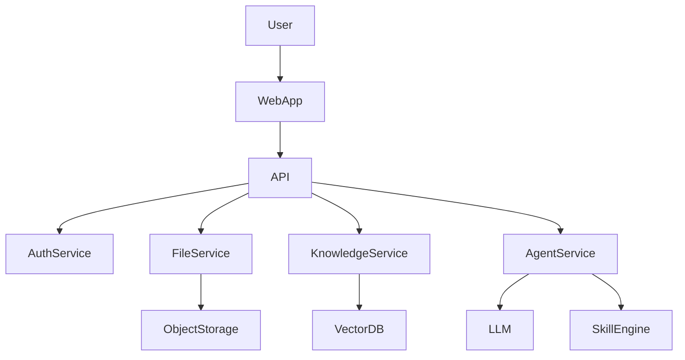

# 技术架构设计

系统架构采用：

微服务 + RAG + AI Agent

核心组件：

1. Web前端
2. API Gateway
3. 用户服务
4. 文件服务
5. 知识库服务
6. AI Agent服务
7. 向量数据库
8. 对象存储

---

# 一、系统架构图
            ┌─────────────┐
            │   Web App   │
            └──────┬──────┘
                   │
            ┌──────▼──────┐
            │ API Gateway │
            └──────┬──────┘
                   │
┌───────────────┬───────────────┬───────────────┐
▼               ▼               ▼
User Service   File Service   Knowledge Service
│               │               │
│               │               │
▼               ▼               ▼
PostgreSQL      ObjectStore     Vector DB
│
▼
Embedding
                   │
                   ▼
            AI Agent Service
                   │
                   ▼
              LLM模型
              ---

# 二、数据流图

# 三、RAG流程

流程：

1. 用户提问
2. 向量检索
3. 召回相关文档
4. 构造 Prompt
5. LLM生成回答

流程：
User Question
     ↓
Embedding
     ↓
Vector Search
     ↓
Top-K Documents
     ↓
Prompt Builder
     ↓
LLM
     ↓
Answer

# 四、SKILL调用机制
SKILL:
查询知识库
文档解析
统计工具

调用流程：

LLM → Tool Selector → Skill → Result