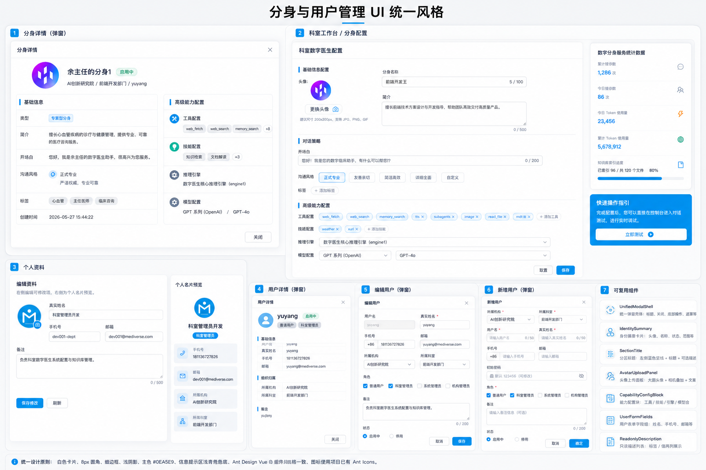
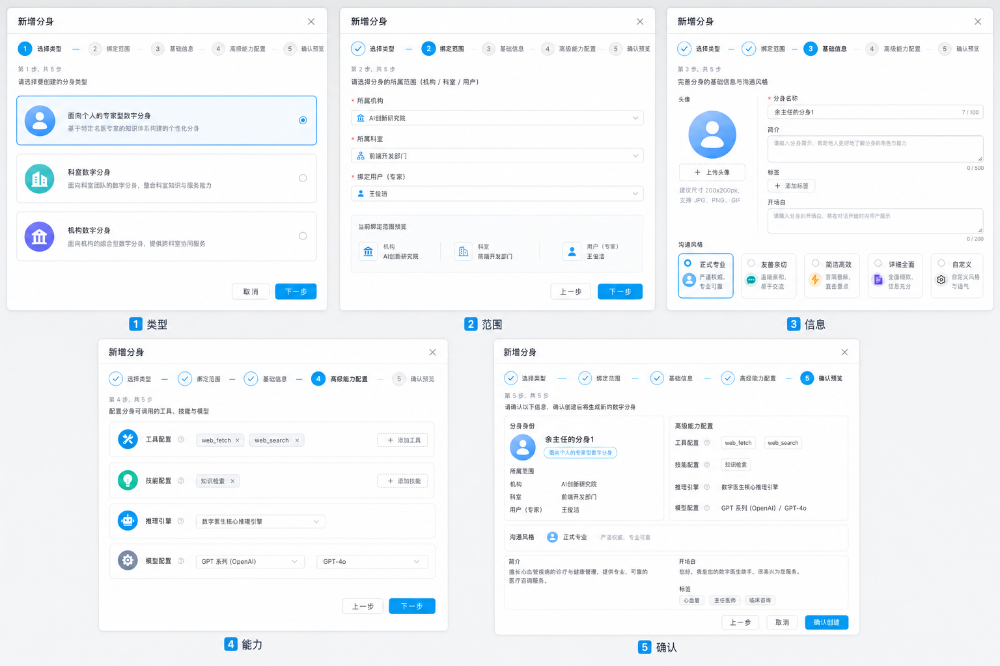
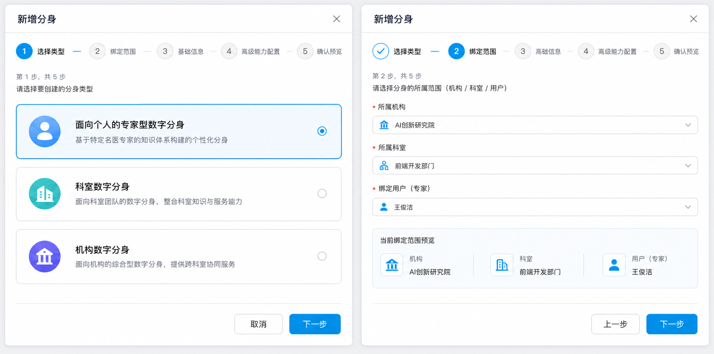
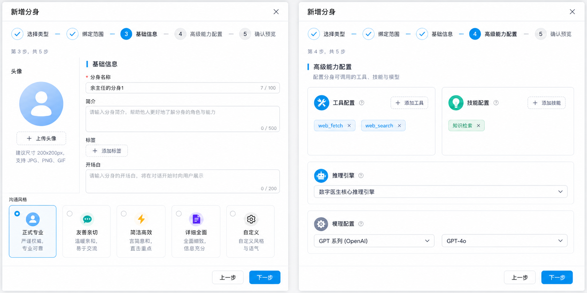
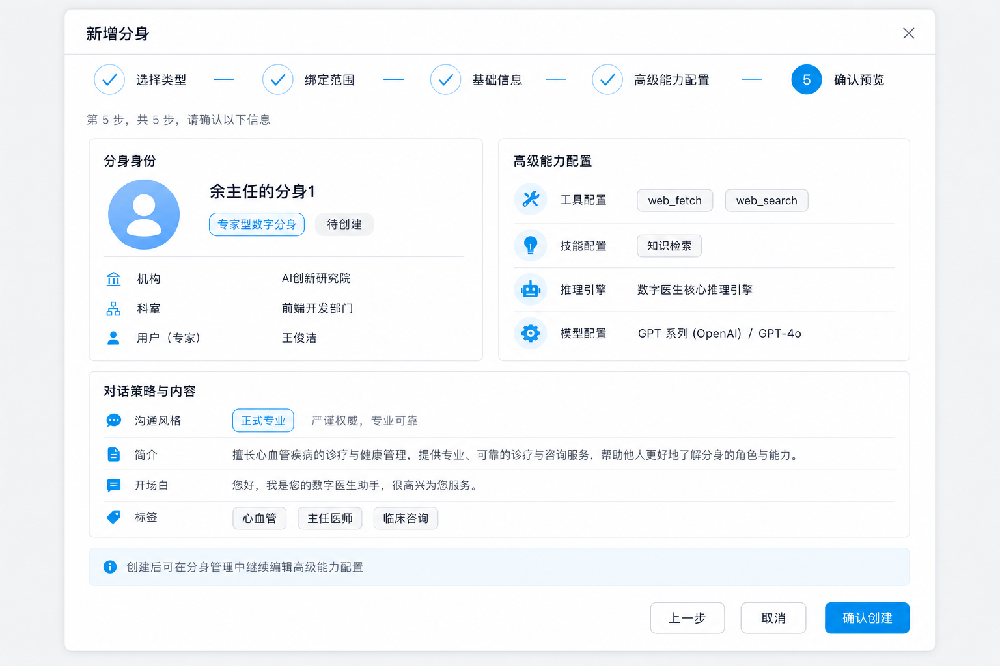

# 分身与用户管理 UI 统一设计规格

## 目标

统一分身详情、新增分身、编辑分身、科室工作台分身配置、个人资料、用户详情、用户编辑、用户新增的视觉语言与组件结构，使它们符合当前 Mediverse Management 的医疗管理后台主题，并能通过少量可复用组件落地。

本规格只约束前端 UI 与交互，不改变接口字段、权限规则、业务流程和表单校验合同。

## 设计参考

### 总览

### 新增分身向导

## 视觉原则

- 主色继续使用项目变量 `--color-primary`，当前为 `#0EA5E9`。
- 背景使用 `--color-bg-layout`，容器使用 `--color-bg-container`。
- 弹框、配置块、只读摘要统一使用 8px 圆角，避免大圆角和装饰性渐变。
- 分区标题统一为左侧蓝色竖线 + 标题 + 可选说明。
- 表单页面保持后台工具属性，强调扫描效率，不做营销式大面积视觉装饰。
- 图标只使用当前项目已安装的 `@ant-design/icons-vue`，不新增图标库。

## 图标约束

实现优先使用项目已出现或已确认可用的 Ant Design Icons：

| 场景 | 图标 |
| --- | --- |
| 关闭 | `CloseOutlined` |
| 添加/上传 | `PlusOutlined` |
| 用户/头像 | `UserOutlined` |
| 沟通/开场白 | `MessageOutlined` |
| 工具 | `ToolOutlined` |
| 技能 | `BulbOutlined` |
| 推理引擎 | `RobotOutlined` |
| 模型/设置 | `SettingOutlined` |
| 详细全面/备注 | `FileTextOutlined` |
| 简洁高效 | `ThunderboltOutlined` |
| 下拉 | `DownOutlined` |
| 搜索 | `SearchOutlined` |
| 上传头像叠加 | `CameraOutlined` |
| 电话 | `PhoneOutlined` |
| 邮箱 | `MailOutlined` |
| 机构 | `BankOutlined` |
| 科室 | `ApartmentOutlined` |
| 用户详情 | `EyeOutlined` |
| 用户编辑 | `EditOutlined` |
| 密码 | `KeyOutlined` 或 `LockOutlined` |
| 启用/停用 | `CheckCircleOutlined` / `StopOutlined` |

## 页面与弹框范围

### 分身详情

文件：`src/views/admin/Avatars/components/AvatarDetailModal.vue`

设计为只读摘要弹框：

- 顶部身份摘要：头像、分身名称、状态、组织路径。
- 左侧基础信息：类型、简介、开场白、沟通风格、标签、创建时间。
- 右侧高级能力配置：工具、技能、推理引擎、模型。
- 底部保留关闭按钮。
- 不再使用整块 `a-descriptions bordered` 作为唯一视觉结构，保留语义但用更轻量的只读行组件渲染。

### 新增分身

文件：

- `src/views/admin/Avatars/components/AvatarWizard.vue`
- `src/views/admin/Avatars/components/steps/StepType.vue`
- `src/views/admin/Avatars/components/steps/StepScope.vue`
- `src/views/admin/Avatars/components/steps/StepInfo.vue`
- `src/views/admin/Avatars/components/steps/StepAdvanced.vue`
- `src/views/admin/Avatars/components/steps/StepConfirm.vue`

保持现有 5 阶段：

1. 选择类型
2. 绑定范围
3. 基础信息
4. 高级能力配置
5. 确认预览

改造重点：

- 步骤条抽成可复用结构，完成态、当前态、未完成态保持一致。
- 第 1 步使用大选项卡表达分身类型。
- 第 2 步在选择机构/科室/用户后展示绑定范围预览。
- 第 3 步与编辑分身视觉一致，左侧头像区，右侧基础字段和沟通风格。
- 第 4 步复用高级能力配置块。
- 第 5 步使用只读预览，不使用大表格。

### 编辑分身

文件：`src/views/admin/Avatars/components/AvatarEditModal.vue`

以现有参考图为基准：

- 左侧头像和分身概览。
- 右侧基础信息、沟通风格、高级能力配置。
- 顶部保留所属机构信息条。
- 高级能力配置复用与新增分身、工作台一致的配置组件。

### 科室工作台分身配置

文件：

- `src/views/dept/Avatar.vue`
- `src/components/AvatarConfig/index.vue`
- `src/components/AvatarConfig/AdvancedConfigFields.vue`
- `src/components/AvatarStats/index.vue`
- `src/components/AvatarConfig/QuickActionGuide.vue`

保持当前页面左右布局：

- 左侧配置表单使用与编辑分身一致的分区标题、头像上传和高级能力配置。
- 右侧统计卡和快速操作指引保留，但边距、标题和按钮风格与左侧一致。
- `AvatarConfig` 仍作为个人、科室、机构三类工作台的共用业务组件。

### 个人资料

文件：`src/views/my/Profile.vue`

保留当前“左侧表单 + 右侧名片预览”的产品结构：

- 左侧表单使用统一头像上传组件。
- 右侧预览使用 `IdentitySummary` 和只读信息行展示电话、邮箱、机构、科室。
- 修改密码入口保留在页头右侧。

### 用户详情、编辑、新增

文件：`src/views/admin/Users/components/UserForm.vue`

同一个组件继续支持三种模式：

- `viewOnly=true`：用户详情。
- `initialRecord` 存在且非只读：编辑用户。
- `initialRecord` 为空：新增用户。

改造重点：

- 详情模式改为身份摘要 + 分组只读信息，减少表格感。
- 编辑模式保留两列表单，用户名禁用，角色和状态可编辑。
- 新增模式在组织/科室后填写用户名、真实姓名、手机号、邮箱、初始密码、角色、备注、状态。
- footer 与分身弹框统一：取消/关闭在左侧或次按钮，确认为主按钮。

## 可复用组件边界

建议新增或抽取以下组件，优先放在 `src/components/`，只放跨页面复用能力：

| 组件 | 责任 | 主要使用方 |
| --- | --- | --- |
| `SectionTitle` | 分区标题、蓝色竖线、说明文本 | 分身、用户、个人资料 |
| `AvatarUploadPanel` | 头像预览、上传按钮、尺寸提示、上传中状态 | 编辑分身、新增分身、工作台、个人资料 |
| `IdentitySummary` | 头像、名称、状态、组织路径摘要 | 分身详情、用户详情、确认预览 |
| `ReadonlyDescription` | 只读字段组、标签、空值 `—` | 分身详情、用户详情、确认预览 |
| `WizardStepper` | 5 步向导进度条 | 新增分身 |
| `CapabilityConfigBlock` | 工具、技能、推理引擎、模型配置壳层 | 分身编辑、新增、工作台 |

`AdvancedConfigFields` 和 `ToolSkillSelector` 已经存在，继续承担高级配置业务选择能力。`CapabilityConfigBlock` 只负责标题、布局和视觉容器，不重复业务状态。

## 非目标

- 不新增图标库。
- 不重写 PageTable、PageFilter、PageTree。
- 不改变用户、分身的接口入参和返回字段。
- 不新增新的路由。
- 不处理后端 `PUT /api/v1/my/avatar` 保存失败问题。

## 验收标准

- 分身详情、编辑分身、新增分身、工作台分身配置的高级能力配置视觉一致。
- 新增分身 5 个阶段在 1024px 宽度下文本不溢出，footer 不遮挡内容。
- 用户详情、用户编辑、用户新增继续由 `UserForm.vue` 支撑，不拆出重复弹框。
- 个人资料页面保持原有保存、刷新、修改密码功能。
- `pnpm verify` 通过。
- Chrome 验收覆盖 `/admin/avatars`、`/dept/avatar`、`/my/profile`、`/admin/users`。
